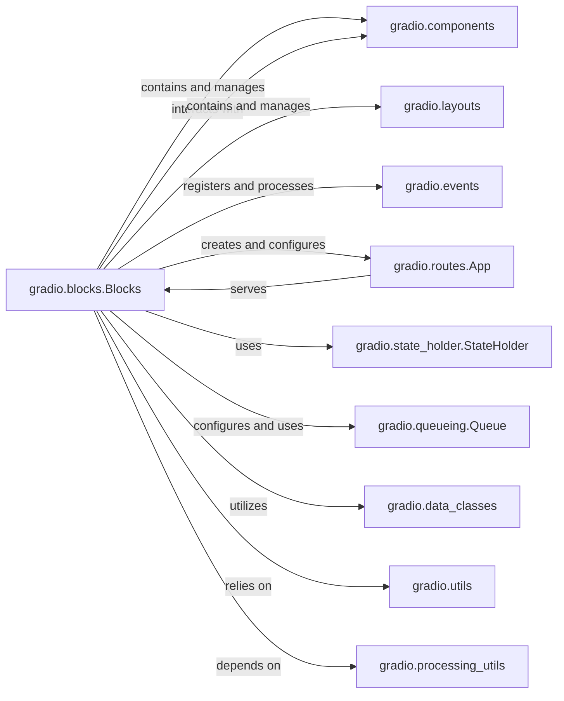

## Component Details

These components are fundamental because they collectively form the complete ecosystem required for a Gradio application to function:

*   `Blocks` is the architect and manager, defining the application's blueprint and overseeing its execution.

*   `Components` and `Layouts` are the visual elements that define the user interface. Without them, there's nothing for the user to interact with.

*   `Events` provides the interactivity, linking user actions to the application's logic.

*   `App` is the server infrastructure, making the application accessible over the web.

*   `StateHolder` ensures data persistence and consistency across user sessions.

*   `Queue` manages backend workload, ensuring smooth performance even under heavy load or with long-running tasks.

*   `Data Classes`, `Utils`, and `Processing Utils` are the support systems, providing the necessary data structures, helper functions, and data transformation capabilities that enable the core components to operate effectively and efficiently.

Together, these components create a robust and flexible framework for building interactive machine learning demos and web applications.

### gradio.blocks.Blocks

The core class that defines the structure and behavior of a Gradio application. It acts as the central hub, managing UI components, event listeners, data flow, and the overall application lifecycle. It's responsible for launching the web server and handling API requests.

**Related Classes/Methods**:

- <a href="https://github.com/gradio-app/gradio/blob/master/gradio/blocks.py#L1103-L3301" target="_blank" rel="noopener noreferrer">`gradio.blocks.Blocks` (1103:3301)</a>

### gradio.components

A package containing all the individual interactive UI elements (e.g., Textbox, Image, Button). These are the fundamental building blocks that users interact with.

**Related Classes/Methods**:

- `gradio.components` (1:1)

- <a href="https://github.com/gradio-app/gradio/blob/master/gradio/components/base.py#L1-L1" target="_blank" rel="noopener noreferrer">`gradio.components.base` (1:1)</a>

### gradio.layouts

Provides classes for arranging and structuring UI components within the application (e.g., Row, Column, Tabs). These define the visual organization and hierarchy.

**Related Classes/Methods**:

- `gradio.layouts` (1:1)

### gradio.events

Manages the event system, enabling UI components to trigger backend Python functions in response to user interactions (e.g., clicks, input changes).

**Related Classes/Methods**:

- <a href="https://github.com/gradio-app/gradio/blob/master/gradio/events.py#L1-L1" target="_blank" rel="noopener noreferrer">`gradio.events` (1:1)</a>

### gradio.routes.App

The underlying FastAPI application that handles all HTTP routing, request processing, and serves the Gradio UI. It's the web server component.

**Related Classes/Methods**:

- <a href="https://github.com/gradio-app/gradio/blob/master/gradio/routes.py#L1-L1" target="_blank" rel="noopener noreferrer">`gradio.routes.App` (1:1)</a>

### gradio.state_holder.StateHolder

Manages the global and session-specific state of the Gradio application, particularly for stateful components and data persistence across interactions.

**Related Classes/Methods**:

- <a href="https://github.com/gradio-app/gradio/blob/master/gradio/state_holder.py#L15-L66" target="_blank" rel="noopener noreferrer">`gradio.state_holder.StateHolder` (15:66)</a>

### gradio.queueing.Queue

Manages the queue for processing API calls, especially for long-running tasks. It ensures orderly request handling, prevents server overload, and provides status updates to the client.

**Related Classes/Methods**:

- <a href="https://github.com/gradio-app/gradio/blob/master/gradio/queueing.py#L102-L812" target="_blank" rel="noopener noreferrer">`gradio.queueing.Queue` (102:812)</a>

### gradio.data_classes

Defines various Pydantic models and other data structures used for internal data exchange within the Gradio application, ensuring type safety and consistency in data flow.

**Related Classes/Methods**:

- <a href="https://github.com/gradio-app/gradio/blob/master/gradio/data_classes.py#L1-L1" target="_blank" rel="noopener noreferrer">`gradio.data_classes` (1:1)</a>

### gradio.utils

A collection of general-purpose utility functions used across the Gradio codebase for common tasks like file operations, path handling, and introspection.

**Related Classes/Methods**:

- <a href="https://github.com/gradio-app/gradio/blob/master/gradio/utils.py#L1-L1" target="_blank" rel="noopener noreferrer">`gradio.utils` (1:1)</a>

### gradio.processing_utils

Contains specialized utility functions for processing data, particularly for handling file uploads, caching, and transforming data for display.

**Related Classes/Methods**:

- <a href="https://github.com/gradio-app/gradio/blob/master/gradio/processing_utils.py#L1-L1" target="_blank" rel="noopener noreferrer">`gradio.processing_utils` (1:1)</a>

### [FAQ](https://github.com/CodeBoarding/GeneratedOnBoardings/tree/main?tab=readme-ov-file#faq)