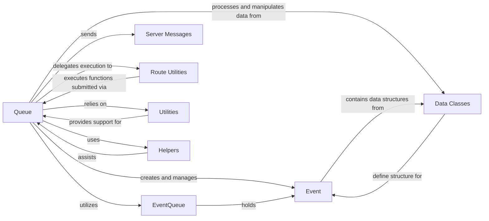

## Component Details

The `Event & Job Queue` subsystem in Gradio is crucial for managing the asynchronous execution of user-submitted events, ensuring the application remains responsive and stable. This analysis focuses on the core components that enable this functionality, their individual responsibilities, and how they interact to form a robust queueing system.

### Queue

The central orchestrator of asynchronous event processing. It manages the lifecycle of user-submitted function calls, from receiving requests and applying concurrency limits to processing them and broadcasting real-time status updates to clients. It ensures application responsiveness and stability under varying loads.

**Related Classes/Methods**:

- `Queue` (1:1)

### Event

Represents a single, user-submitted function call or task within the queue. It encapsulates all necessary information for processing, including session details, the target function, request data, and its current status (e.g., progress, alive status).

**Related Classes/Methods**:

- `Event` (1:1)

### EventQueue

A specialized queue that holds `Event` objects for a specific function, identified by a `concurrency_id`. It helps enforce concurrency limits for individual functions, preventing a single busy function from monopolizing the main queue.

**Related Classes/Methods**:

- `EventQueue` (1:1)

### Server Messages

Defines the structured message formats used for communication between the Gradio server (including the queue) and the client. These messages convey critical information such as processing status, estimated completion times, progress updates, and final results or errors.

**Related Classes/Methods**:

- `Server Messages` (1:1)

### Route Utilities

Provides functions for compiling and executing the actual Gradio functions associated with an event. It acts as an intermediary between the queue's event processing logic and the core application's function execution.

**Related Classes/Methods**:

- `Route Utilities` (1:1)

### Utilities

A collection of general-purpose helper functions and classes that support the `Queue`'s operations. This includes mechanisms for running asynchronous coroutines in the background, managing locks for thread safety, and implementing LRU caches for efficiency.

**Related Classes/Methods**:

- `Utilities` (1:1)

### Data Classes

Defines the data structures used throughout the Gradio application, including those for representing event payloads (`PredictBodyInternal`) and other structured information exchanged between components.

**Related Classes/Methods**:

- `Data Classes` (1:1)

### Helpers

A module containing various helper functions, including `TrackedIterable`, which is crucial for managing and tracking the progress of iterable outputs from Gradio functions, especially in streaming scenarios.

**Related Classes/Methods**:

- <a href="https://github.com/gradio-app/gradio/blob/master/demo/dashboard/helpers.py#L1-L1" target="_blank" rel="noopener noreferrer">`Helpers` (1:1)</a>

### [FAQ](https://github.com/CodeBoarding/GeneratedOnBoardings/tree/main?tab=readme-ov-file#faq)