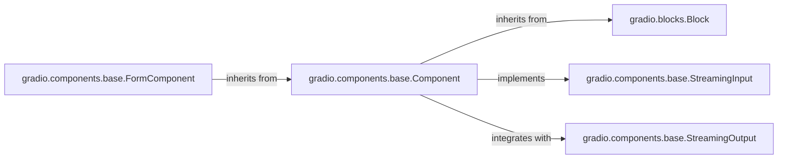

## Component Details

The UI Component Base subsystem in Gradio is centered around the `gradio.components.base.Component` class, which serves as the abstract foundation for all interactive user interface elements. This component defines the essential properties, behaviors, and lifecycle methods that all Gradio UI components must adhere to, enabling seamless data transformation, API interaction, and event handling. Its design ensures consistency and extensibility across diverse input and output types.

### gradio.components.base.Component

The abstract base class for all interactive Gradio UI components. It provides common properties (e.g., `label`, `interactive`, `visible`) and crucial methods for data processing (`preprocess`, `postprocess`), API schema definition (`api_info`), and event management (`attach_load_event`). It acts as the central hub for component functionality.

**Related Classes/Methods**:

- <a href="https://github.com/gradio-app/gradio/blob/master/gradio/components/base.py#L0-L0" target="_blank" rel="noopener noreferrer">`gradio.components.base.Component:preprocess` (0:0)</a>

- <a href="https://github.com/gradio-app/gradio/blob/master/gradio/components/base.py#L0-L0" target="_blank" rel="noopener noreferrer">`gradio.components.base.Component:postprocess` (0:0)</a>

- <a href="https://github.com/gradio-app/gradio/blob/master/gradio/components/base.py#L0-L0" target="_blank" rel="noopener noreferrer">`gradio.components.base.Component:api_info` (0:0)</a>

- <a href="https://github.com/gradio-app/gradio/blob/master/gradio/components/base.py#L0-L0" target="_blank" rel="noopener noreferrer">`gradio.components.base.Component:attach_load_event` (0:0)</a>

### gradio.blocks.Block

The foundational building block for all UI elements in Gradio, including both interactive components and layout structures. `gradio.components.base.Component` inherits from `Block`, meaning all interactive components are fundamentally also blocks, benefiting from `Block`'s rendering and structural properties.

**Related Classes/Methods**: _None_

### gradio.components.base.FormComponent

A specialized abstract base class for Gradio components that are typically used within forms. It extends the base `Component` functionality with considerations specific to form interactions, such as handling submission and data validation within a form context.

**Related Classes/Methods**: _None_

### gradio.components.base.StreamingInput

An interface (or mixin) that defines the contract for Gradio components capable of handling real-time, streaming input data. Components implementing this interface provide specific methods or properties to manage continuous data streams from the frontend.

**Related Classes/Methods**: _None_

### gradio.components.base.StreamingOutput

An interface (or mixin) that defines the contract for Gradio components capable of producing real-time, streaming output data. Components implementing this interface provide mechanisms to send continuous data streams to the frontend.

**Related Classes/Methods**: _None_

### [FAQ](https://github.com/CodeBoarding/GeneratedOnBoardings/tree/main?tab=readme-ov-file#faq)