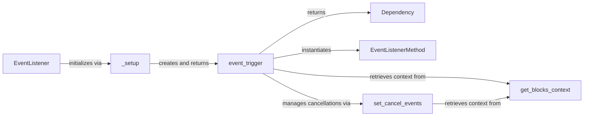

## Component Details

The `UI Event Linker` subsystem in Gradio is responsible for establishing and managing the connection between user interface events (e.g., button clicks, text changes) and their corresponding backend Python functions. It orchestrates the flow of data between input components, the executed function, and output components, enabling dynamic updates and interactive behavior within the application.

### EventListener

This class serves as the primary interface for defining a Gradio event. It encapsulates the event's name and properties, and crucially, it orchestrates the creation of the actual event handling logic by calling its static `_setup` method.

**Related Classes/Methods**:

- `EventListener` (1:1)

- `EventListener._setup` (1:1)

### _setup

A static factory method within the `EventListener` class. Its core responsibility is to configure and return the `event_trigger` function, embedding all necessary event parameters and behaviors into the callable.

**Related Classes/Methods**:

- `EventListener._setup` (1:1)

- `event_trigger` (1:1)

### event_trigger

This is the executable function returned by `_setup` that is invoked when a UI event occurs. It handles the entire event lifecycle: retrieving the application context, identifying the event target, registering the event with the `Blocks` instance, executing the user-defined Python function, processing inputs/outputs, and managing event cancellations.

**Related Classes/Methods**:

- `event_trigger` (1:1)

- `get_blocks_context` (1:1)

- `EventListenerMethod` (1:1)

- `set_cancel_events` (1:1)

- `Dependency` (1:1)

### get_blocks_context

A utility function that retrieves the current `Blocks` instance or its configuration. The `Blocks` instance is the root container for all Gradio components and event dependencies, providing the essential context required for event registration and management within the application.

**Related Classes/Methods**:

- `get_blocks_context` (1:1)

### Dependency

A data structure that represents a registered event dependency. It encapsulates vital configuration information about the event and provides methods (`.then()`, `.success()`) for chaining events, enabling sequential execution of functions based on the completion or success of a preceding event.

**Related Classes/Methods**:

- `Dependency` (1:1)

### EventListenerMethod

A simple class used to encapsulate the specific target of an event, typically comprising a Gradio component (e.g., `Button`, `Textbox`) and the precise event name (e.g., `.click`, `.change`). It provides a clear identifier for which event on which component is being listened to.

**Related Classes/Methods**:

- `EventListenerMethod` (1:1)

### set_cancel_events

This function is responsible for managing the cancellation of other ongoing events when a specific event is triggered. It interacts with the `Blocks` context to register cancellation logic, which is crucial for controlling the flow of execution, preventing redundant operations, or stopping long-running processes.

**Related Classes/Methods**:

- `set_cancel_events` (1:1)

- `get_blocks_context` (1:1)

### [FAQ](https://github.com/CodeBoarding/GeneratedOnBoardings/tree/main?tab=readme-ov-file#faq)