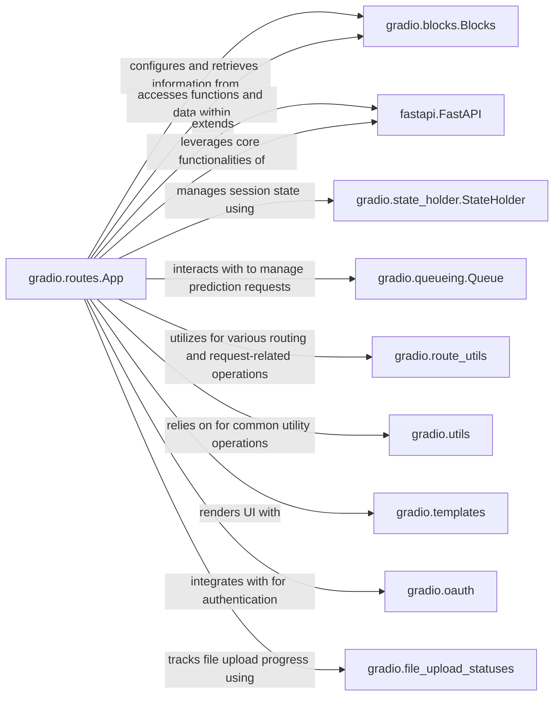

## Component Details

The `Web Server & API Handler` component, primarily embodied by the `gradio.routes.App` class, is a FastAPI application that serves as the core of a Gradio interface. It handles all incoming HTTP and WebSocket requests, routes them to the appropriate backend logic, and manages the overall application lifecycle.

### gradio.routes.App

The central FastAPI application that orchestrates all web traffic, including serving the Gradio UI, handling API requests, managing user sessions, and facilitating file uploads and streaming. It acts as the primary interface between the client and the Gradio backend.

**Related Classes/Methods**:

- <a href="https://github.com/gradio-app/gradio/blob/master/gradio/routes.py#L0-L0" target="_blank" rel="noopener noreferrer">`gradio.routes.App` (0:0)</a>

### gradio.blocks.Blocks

Represents the Gradio application's structure and logic. The `App` class holds a reference to a `Blocks` object, which contains the UI components, event listeners, and backend functions. `App` interacts with `Blocks` to retrieve configuration, API information, and to access the underlying queue and state management.

**Related Classes/Methods**:

- <a href="https://github.com/gradio-app/gradio/blob/master/gradio/blocks.py#L1103-L3301" target="_blank" rel="noopener noreferrer">`gradio.blocks.Blocks` (1103:3301)</a>

### fastapi.FastAPI

The underlying web framework that `gradio.routes.App` inherits from. It provides the core functionalities for building web APIs, including routing, middleware, dependency injection, and request/response handling.

**Related Classes/Methods**:

### gradio.state_holder.StateHolder

Manages the session-specific state for each connected client. This includes storing component states, iterators, and other data that needs to persist across multiple requests within a user's session.

**Related Classes/Methods**:

- <a href="https://github.com/gradio-app/gradio/blob/master/gradio/state_holder.py#L15-L66" target="_blank" rel="noopener noreferrer">`gradio.state_holder.StateHolder` (15:66)</a>

### gradio.queueing.Queue

Handles the queuing of prediction requests to ensure orderly processing of backend functions, especially when the application is under heavy load or when functions are long-running.

**Related Classes/Methods**:

- <a href="https://github.com/gradio-app/gradio/blob/master/gradio/queueing.py#L102-L812" target="_blank" rel="noopener noreferrer">`gradio.queueing.Queue` (102:812)</a>

### gradio.route_utils

Provides utility functions specifically for routing and request processing within the Gradio application. This includes functions for compiling Gradio requests, getting root URLs, and updating configuration.

**Related Classes/Methods**:

- <a href="https://github.com/gradio-app/gradio/blob/master/gradio/route_utils.py#L0-L0" target="_blank" rel="noopener noreferrer">`gradio.route_utils` (0:0)</a>

### gradio.utils

A collection of general utility functions used across the Gradio codebase, including safe path joining, error handling, and deep copying.

**Related Classes/Methods**:

- <a href="https://github.com/gradio-app/gradio/blob/master/gradio/utils.py#L0-L0" target="_blank" rel="noopener noreferrer">`gradio.utils` (0:0)</a>

### gradio.templates

Responsible for rendering HTML templates for the Gradio UI. The `App` uses this component to serve the main Gradio interface and other HTML pages.

**Related Classes/Methods**:

- <a href="https://github.com/gradio-app/gradio/blob/master/gradio/templates.py#L0-L0" target="_blank" rel="noopener noreferrer">`gradio.templates` (0:0)</a>

### gradio.oauth

Handles OAuth authentication flows, allowing users to sign in with external providers like Hugging Face.

**Related Classes/Methods**:

- <a href="https://github.com/gradio-app/gradio/blob/master/gradio/oauth.py#L0-L0" target="_blank" rel="noopener noreferrer">`gradio.oauth` (0:0)</a>

### gradio.file_upload_statuses

Manages the progress and status of file uploads, providing real-time updates to the client.

**Related Classes/Methods**:

- `gradio.file_upload_statuses` (0:0)

### [FAQ](https://github.com/CodeBoarding/GeneratedOnBoardings/tree/main?tab=readme-ov-file#faq)