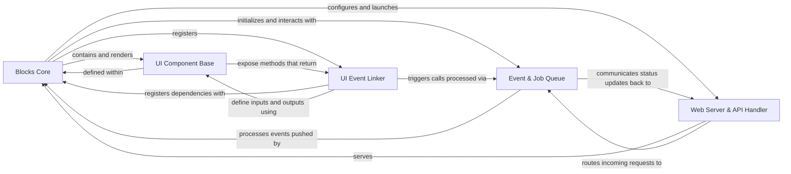

## Component Details

The core architecture of Gradio is built upon five fundamental components: `Blocks Core` (orchestrator), `UI Component Base` (UI building blocks), `Web Server & API Handler` (gateway), `Event & Job Queue` (backend processing), and `UI Event Linker` (frontend-backend glue). These components collectively manage the lifecycle, user interface, event handling, and backend processing, forming an indispensable and interconnected system for any Gradio application.

### Blocks Core

The central orchestrator and container for Gradio applications. It defines the application's layout, manages the lifecycle, handles state, and coordinates interactions between UI components and backend logic. All Gradio applications, whether built directly or via higher-level APIs, are ultimately structured around a `Blocks` instance.

**Related Classes/Methods**:

- <a href="https://github.com/gradio-app/gradio/blob/master/gradio/blocks.py#L1103-L3301" target="_blank" rel="noopener noreferrer">`gradio.blocks.Blocks` (1103:3301)</a>

### UI Component Base

The abstract foundation for all interactive user interface elements in Gradio. It defines common properties and crucial methods for data transformation (`preprocess` for input, `postprocess` for output) and API interaction, enabling diverse input and output types (e.g., Textbox, Image, Button).

**Related Classes/Methods**:

- <a href="https://github.com/gradio-app/gradio/blob/master/gradio/components/base.py#L1-L1" target="_blank" rel="noopener noreferrer">`gradio.components.base.Component` (1:1)</a>

### Web Server & API Handler

The FastAPI-based web server responsible for handling all HTTP requests, routing, and serving the Gradio application's UI and API endpoints. It acts as the primary interface between the client (browser or `gradio_client`) and the Gradio backend, making the application accessible.

**Related Classes/Methods**:

- <a href="https://github.com/gradio-app/gradio/blob/master/gradio/routes.py#L1-L1" target="_blank" rel="noopener noreferrer">`gradio.routes.App` (1:1)</a>

### Event & Job Queue

Manages the asynchronous execution of user-submitted events (function calls). It handles concurrency, prioritizes jobs, and provides real-time status updates to clients, ensuring the application remains responsive and stable under varying loads.

**Related Classes/Methods**:

- <a href="https://github.com/gradio-app/gradio/blob/master/gradio/queueing.py#L102-L812" target="_blank" rel="noopener noreferrer">`gradio.queueing.Queue` (102:812)</a>

### UI Event Linker

Connects specific frontend UI events (e.g., button clicks, text changes) to corresponding backend Python functions. It defines the flow of data between input components, the function, and output components, orchestrating interactive behavior and dynamic updates within the application.

**Related Classes/Methods**:

- <a href="https://github.com/gradio-app/gradio/blob/master/gradio/events.py#L1-L1" target="_blank" rel="noopener noreferrer">`gradio.events.EventListener` (1:1)</a>

### [FAQ](https://github.com/CodeBoarding/GeneratedOnBoardings/tree/main?tab=readme-ov-file#faq)