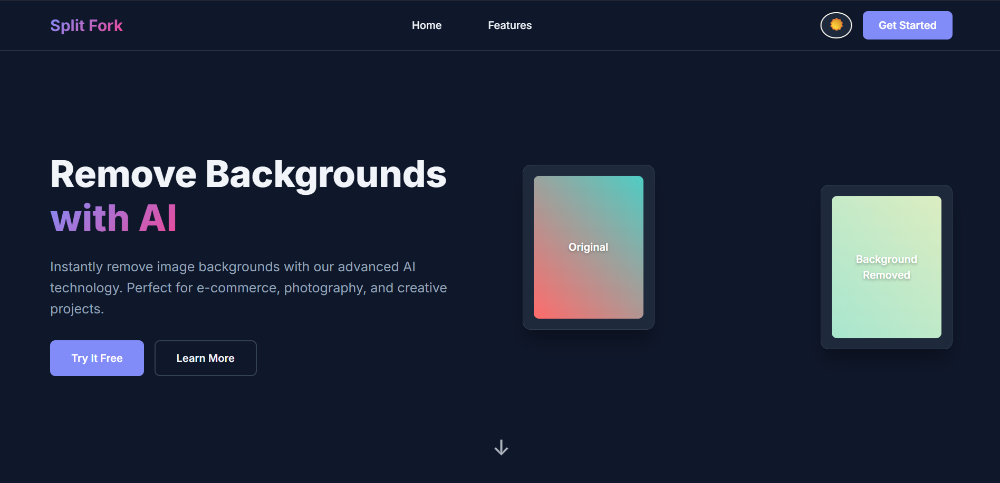
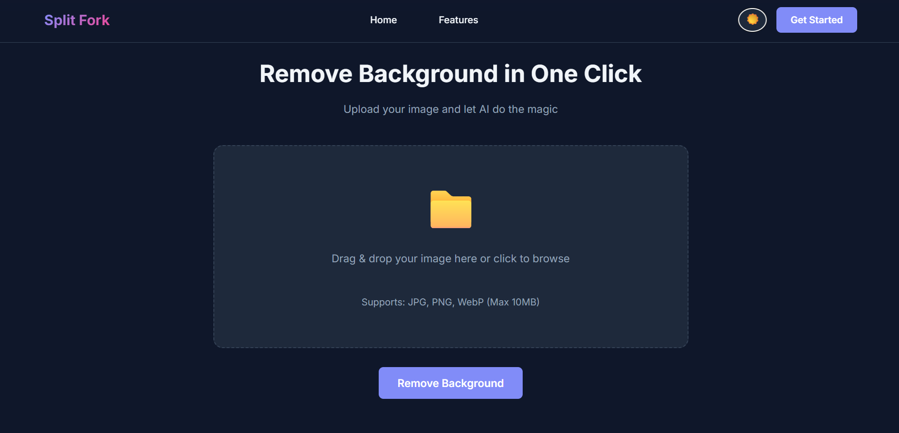
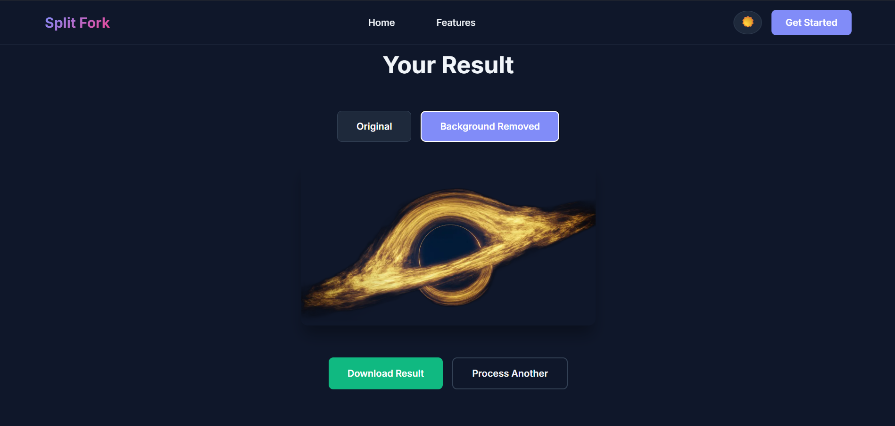

<div style="text-align: center;">
    
</div>

# Using Gradio JS Client in a React Project

## 1. Introduction to Gradio Client

**What is Gradio Client?**  

Gradio Client is a JavaScript library that allows you to interact programmatically with any Gradio app, treating it like an API.

**Why use it?**  
- Easy integration with web apps.  
- Works with Hugging Face Spaces or self-hosted Gradio apps.  
- Supports multiple input types: text, images, audio, files.  
- Enables real-time updates for iterative endpoints or generator apps.

**Links & Resources:**  
- [Gradio JS Client on NPM](https://www.npmjs.com/package/@gradio/client)  
- [Gradio Docs](https://gradio.app/docs/)

---

## 2. Creating a Gradio App and Hosting on Hugging Face

**Step 1: Create a simple Gradio app**  

Example: a background remover powered by ai.<br> (orginal -> background removed)

the code below is refers the gradio app we build for infrence at 
[app_template](js_template.py) 

check out resources to get a better grasp of how gradio works.  [Gradio JS Client on NPM](https://www.npmjs.com/package/@gradio/client) , [Gradio Docs](https://gradio.app/docs/)

**Requirements :**
```md
pip install gradio rembg pillow
```

**CODE :**
```python
import gradio as gr
from rembg import remove, new_session
from PIL import Image
import io

# create session once to avoid reloading the model every time make infrence faster
session = new_session(model_name="u2netp")

def remove_background(input_image):
    if input_image is None:
        return None
    max_size = 1024
    input_image.thumbnail((max_size, max_size))
    img_bytes = io.BytesIO()
    input_image.save(img_bytes, format='PNG')
    img_bytes = img_bytes.getvalue()
    output_bytes = remove(img_bytes, session=session)
    output_image = Image.open(io.BytesIO(output_bytes))
    return output_image

with gr.Blocks(title="AI Background Remover") as demo:
    gr.HTML("""
    <div style="text-align:center;">
        <h2>AI Background Remover</h2>
        <p>Remove backgrounds instantly — 100% free and local!</p>
    </div>
    """)
    with gr.Row():
        input_img = gr.Image(type="pil", label="Upload Image")
        output_img = gr.Image(type="pil", label="Background Removed")
    with gr.Row():
        remove_btn = gr.Button("Remove Background")
        clear_btn = gr.Button("Clear")
    remove_btn.click(remove_background, inputs=input_img, outputs=output_img)
    clear_btn.click(lambda: (None, None), inputs=None, outputs=[input_img, output_img])

demo.launch()
```

# **Hosting on Hugging Face**

Step 1: got to [hugging face spaces](https://huggingface.co/spaces/) (a platform host gradio app for inference free of cost)

Step 2: click on new space and fill up space name and discription along with lisence 
 
! keep in mind !
- if space is made **"public"** no authentication is required during infrence
- if space is made **"private"** authentication is required during infrence

Step 3: Follow the hugging face steps to push your app and other files **( requirement.txt, .gitignore , README.md , etc )** to the hugging face space 

**RESULT**: On pushing the files your app will be deployed on the hugging face which you can use to make inference for your website

# Making Inference Script

for demo purposes we will make a plain infrence script using gradio client for better understanding 

<h2>Installation JS Gradio Client</h2>

```cli
# Initialize a new Node.js project with default settings
npm init -y

# Install the Gradio client package
npm install @gradio/client
```

starting with code

- Step 1: import Js Gradio client and other pakages

```js
import { Client, handle_file } from "@gradio/client";
```

- Step 2: Connect to hugging face space

```js
// Initialize the Gradio client for your Hugging Face Space
const SPACE_NAME = "w-samik/background_remover"; 

let app;

export async function connectClient() {
  if (!app) {
    app = await Client.connect(SPACE_NAME);
  }
  return app;
}
```

- Stemp 3: Making a function for inference

```js
export async function removeBackground(file) {
  const app = await connectClient();
  const result = await app.predict(0, [handle_file(file)]);
  return result.data[0].url; // The processed image URL
}
```
**NOTE** : In this case we are calling a button as no predict endpoint is set refer [Gradio JS Client on NPM](https://www.npmjs.com/package/@gradio/client) for better understanding.

```js
// full code
import { Client, handle_file } from "@gradio/client";

const SPACE_NAME = "w-samik/background_remover"; // Replace with your actual Space name

let app;

export async function connectClient() {
  if (!app) {
    app = await Client.connect(SPACE_NAME);
  }
  return app;
}

export async function removeBackground(file) {
  const app = await connectClient();
  const result = await app.predict(0, [handle_file(file)]);
  return result.data[0].url; // The processed image URL
}
```

-Step 5: test run the above code <i>(this will give you the url path of background removed image as output)</i>

```cli
node <your_file.js>
```

# Integrating Gradio Client in React website

make a github repo for the react website project or clone [template](https://github.com/W-Samik/background_remover) or download the [vercel_template.zip](vercel_template.zip) from gradio github repository.

we will do the inference using the [infrence.js Script](#making-inference-script) as follows in our template.


```jsx
import { removeBackground } from "../utils/inference";
const resultUrl = await removeBackground(file);
```

**NOTE :** This project is made in **vite react** with **javascript** 

# Hosting on Vercel 

we will be using vercel to host our site 

- Step 1: Open [vercel](https://vercel.com/)
- Step 2: Login in vercel using your github account 
- Step 3: **Import** the template repository
- Step 4: build website complete

you can use template webstie given on [gradio repository](vercel_template.zip) or fork the template from my [presonal repository](https://github.com/W-Samik/background_remover)

# Hosted Template Website

<i>**HERO PAGE**</i>



<i>**UPLOAD**</i>



<i>**RESULT**</i>



<i>we have achived a website that is easily integrated with the power of gradio js client to produce full functional production websites. </i>

<div style="text-align: center; margin-top: 50px;">
  <p style="margin-bottom: 15px; font-size: 18px; font-weight: 500;">
    Clone for template is provided below
  </p>
</div>

<div style="text-align: center;">
  <a href="https://github.com/W-Samik/background_remover">Clone Repository</a>
</div>
<br>
<div style="text-align: center;">
OR
</div>
<br>

```cli
git clone https://github.com/W-Samik/background_remover.git
```


