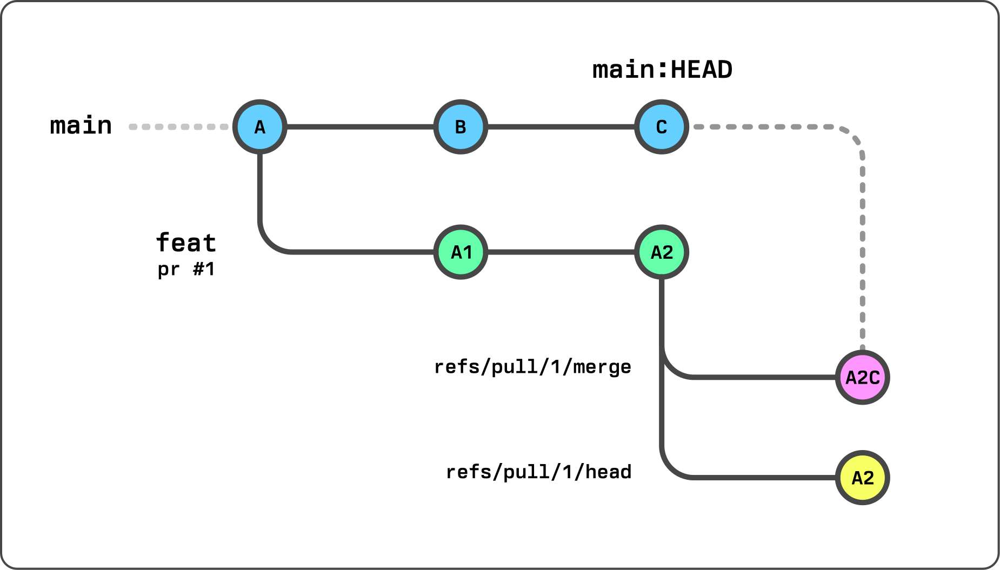

# Continous Integration

The CI for Gradio uses GitHub Actions and almost all of the configuration to run the CI exists within the repo.

The two cardinal rules that we have for CI are that:

- CI should run on _all_ pull requests, whether those PRs are made from forks or from a branch within the repo.
- These runs must be secure and _never_ leak any secrets, even if the run needs to have access to secrets in order to run successfully.

More information on how we achieve this can be found in the [architecture section of this document](#architecture).

## High-level overview

Broadly speaking, CI is split into three main parts.

- Quality
- Deployments
- Versioning and Publishing

### When do checks run

Checks only run when needed but are required to pass when they run.

We check to see which source files have changed and run the necessary checks. A full breakdown of how we determine this for each kind of check can be found in the [`changes` action](https://github.com/gradio-app/gradio/blob/main/.github/actions/changes/action.yml#L65-L108) but the high-level breakdown is as follows:

- **Python checks** - whenever Python source, dependencies or config change.
- **Javascript checks** - whenever JavaScript source, dependencies or config change.
- **functional and visual checks** - whenever any source of config changes (most of the time).
- **repo hygiene checks** - always.

Checks almost always run when the CI config has changed.

If a check can be skipped, the status is set to `success` (green tick) to satisfy the GitHub required checks, but the message will have a text of `Skipped`.

### Quality

We run a series of quality checks on the repo. These range from static checks like linting to unit tests all the way through to fully end-to-end functional tests.

All tests have a name of something like `test-<type>-<os>-<stability-level>`. `os` and `stability-level` are optional.

This is a simple breakdown of our current quality checks:

| Language   | Check           | operating system | Workflow file              | Notes                                        |
| ---------- | --------------- | ---------------- | -------------------------- | -------------------------------------------- |
| Python     | Linting         | linux            | `test-python.yml`          |                                              |
| Python     | Formatting      | linux            | `test-python.yml`          |                                              |
| Python     | Type-checking   | linux            | `test-python.yml`          |                                              |
| Python     | Unit tests      | linux            | `test-python.yml`          |                                              |
| Python     | Unit tests      | windows          | `test-python.yml`          |                                              |
| JavaScript | Linting         | linux            | `test-js.yml`              |                                              |
| JavaScript | Formatting      | linux            | `test-js.yml`              |                                              |
| JavaScript | Type-checking   | linux            | `test-js.yml`              |                                              |
| JavaScript | Unit tests      | linux            | `test-js.yml`              |                                              |
| n/a        | Functional      | linux            | `test-functional.yml`      |                                              |
| n/a        | Functional Lite | linux            | `test-functional-lite.yml` |                                              |
| n/a        | Visual          | linux            | `deploy+test-visual/yml`   |                                              |
| n/a        | Large files     | linux            | `test-hygiene.yml`         | Checks that all files are below 5 MB         |
| n/a        | Notebooks match | linux            | `test-hygiene.yml`         | Ensures that notebooks and demos are in sync |

One important thing to note is that we split 'flaky' and 'non-flaky' Python unit/integration tests out.
These tests are flaky because of network requests that they make. They are typically fine, but anything that can cause a red check in PRs makes us less trustworthy of our CI and confidence is the goal!
The Windows tests are also very slow and only test a few edge cases.
The flaky and Windows tests are not run in every PR, but are always run against the release PR to ensure everything is working as expected prior to a release.
All other checks are run for every pull request, ensuring everything will work when we merge into `main`.

For more information about the tests and tools that we use and our approach to quality, check the [testing-strategy](https://github.com/gradio-app/gradio/blob/main/testing-guidelines/quality-strategy.md) document. For more information on how to run and write tests, see the [contributing guide](https://github.com/gradio-app/gradio/blob/main/CONTRIBUTING.md).

### Deployments

We have three different deployment types that happen when a pull request is created:

- website (`deploy-website.yml`)
- spaces (`deploy-spaces.yml`)
- storybook (`deploy+test-visual.yml`)

#### website

When a PR is created and source code has changed, a preview of the website is created.

When a PR is merged into `main` the production version of the website is redeployed with the latest changes.

Documentation is stored by version, `main` represents the current version of the repo which may or may not match the latest release version. The process of generating documentation is roughly like this:

- In Pull Requests, `main` documentation is built from the pull request branch, reflecting the latest changes in that PR (when selecting the `main` option on the docs or guides).
- When we merge a normal pull request into `main` the documentation is built from the repo, reflecting the latest changes on `main`. The demo spaces are also redeployed to Hugging Face Spaces at this point (the space variant with the `main_` prefix).
- When a new version of Gradio is released (when a versioning PR is merged), the current documentation in the repo is deployed under a version tag. So for version `3.1.1` the current docs and guides in main will be available under that version for eternity. At this point `main` (built from source) and `3.1.1` (built from source and stored in the cloud) are equivalent. We also redeploy demo spaces when a new Gradio version is released, this time without the `main_` prefix.

> [!NOTE]
> Our non-main documentation is all stored in S3.
> Each version `x.x.x` has its own folder containing a JSON file with all docs and guides.
> They are immortal.

#### spaces

For every pull request we deploy a Gradio app to Hugging Face Spaces. This allows us to test out new features and check for any obvious issues. This process is follows:

- Build Gradio and create a wheel
- Upload the wheel to S3
- Copy certain demos to a folder with some configuration
- Create a requirements.txt contain links to the uploaded wheels
- Create the necessary spaces configuration (via a README.md file)
- Create a space using the `huggingface_hub` library
- Add a comment linking to the space and explaining how to install that version of `gradio` and `gradio_client`

These spaces are cleaned up after a certain period of time has passed, the wheels are immortal.

#### storybook

We redeploy storybook on every pull request that contains changes to the frontend source code to allow users to preview visual changes. Each PR is commented with a link to the storybook deployment. This deployment is also responsible for our visual tests as they are part of the same process.

The storybook deploment process is relatively simple as we use an action created by the storybook developers and use their service (chromatic) to handle this:

- Python needs to be installed and gradio needs to be installed locally in order to generate the gradio theme.
- The theme is generated.
- The storybook application is built.
- The storybook application is uploaded to chromatic.

### Versioning and publishing

Versioning is made up of two components:

- Each pull request has to explain what kind of change it introduces.
- When a pull request is merged into `main` we need to figure out what the next version for package should be based on the combination of all changes and whether or not we should publish.

To manage versioning and publishing we use a combination of the [`changesets`](https://github.com/changesets/changesets) library and some custom additions.

#### pull request changesets

Each pull request must include a changeset file. This is a simple markdown file that states what _type_ of change it is, what (if any) version bump is required for each affected package, and a description of that change.

Change types are purely semantic and we only use them to organise the changelog. These "types" are related to bump types but they are not the same. They can be one of the following:

- `fix` - we fixed a thing.
- `feature` - we added a new capability.
- `highlight` - we did something that we want to feature prominently in the changelog.

For bump types we follow semantic versioning:

- `patch` - No API changes, these are typically bug fixes, refactors, and docstring changes.
- `minor` - API additions, everything works as it did before but new API may have been added.
- `major` - breaking changes.

We tend to plan breaking changes ahead of time, we don't release new majors very frequently.

> [!NOTE]
> This is a goal. We are not perfect. Regressions sneak in, accidental breakages happen.
> It isn't a big deal but we need to fix them ASAP and try to make sure it doesn't happen again in the future.

These changesets appear in the `.changeset` directory as markdown files and each changeset has its own dedicated file (this reduces conflicts). These changeset can be written manually or generated via a CLI but we try to automatically detect the changes in a PR and generate a changeset. This isn't always perfect but it is pretty reliable. The changeset can be updated by modifying labels, editing the issue, or modifying the file directly.

#### merging into `main`

When a pull request is merging to main there are two possible routes.

- Create or update a versioning PR
- Publish packages

A normal pull request created by a user that does not contain a changeset will do nothing.

A normal pull request created by a user that _does_ contain a changeset will either create or update a versioning PR. This is a PR that tracks the changelog and versions that will be used for the release. The changelogs for each package are generated from the descriptions in the changeset files. The generated version pull request is on a branch named `changeset-release/main` and there is only ever one (unless we are also working on a pre-release).

When the `changeset-release/main` branch is merged into main all of the necessary versions will have been bumped and the changelogs generated. We then go through to see what needs to be published and publish to PyPi for Python packages and npm for JavaScript pacakges.

## Architecture

The CI on this repo is a little unconventional, this is mainly to work around various gaps in the GitHub Actions API while solving for our use case.

The [technical details](#technical-details) below explain how things are setup, the [context](#context) sections explains what problem we are trying to solve with this architecture, why we took this approach, and the various challenges we faced along the way. It is a little 'extra' for repo docs but serves as good context for the future.

Please show me a gigantic diagram of the CI

ok.

### Technical details

Most our our workflows are contained within the repository but we also have some custom JavaScript actions that are stored in the [gradio-app/github](https://github.com/gradio-app/github) repository. These actions will be mentioned below but I'll put a list here for ease of navigation:

- [`find-pr`](https://github.com/gradio-app/github/tree/main/packages/find-pr) - for getting a pr number, pr branch, and other metadata for a `workflow_run`.
- [`comment-pr`](https://github.com/gradio-app/github/tree/main/packages/comment-pr) - for creating and updating comments on a pull request.
- [`commit-status`](https://github.com/gradio-app/github/tree/main/packages/commit-status) - for creating statuses on commits.
- [`generate-changeset`](https://github.com/gradio-app/github/tree/main/packages/generate-changeset) - for generating and updating changesets based on the state or a pr and branch.
- [`publish-pypi`](https://github.com/gradio-app/github/tree/main/packages/publish-pypi) - for publishing packages to pypi.

From a technical point of view our workflows can be split into two categories:

- Quality, deployment and versioning for pull requests
- Final versioning and release when merged into main

#### Pull requests

Every PR run triggers a 'trigger' workflow that does nothing itself but acts as a trigger for other workflows to run via the `workflow_run` event.

##### changes

With the exception of the `hygiene` check everything is conditional and will only run if specific files have changes. These runs all have one job that everything else depends on that reuses a composite [`changes`](https://github.com/gradio-app/gradio/tree/main/.github/actions/changes) action, this action determines whether or not a check should run based on the files that have changed and also determines important metadata about the pull request that triggered the run. The [`find-pr`](https://github.com/gradio-app/github/tree/main/packages/find-pr) action is responsible for getting this metadata that all runs rely on.

When we know what branch we are on, what pr we care about, and what has changed we can decide how to continue. If we _do not_ need to run this job then we will set the output of the job to success and skip all subsequent steps. Steps following the `changes` step all have a condition of `if: needs.changes.outputs.should_run == 'true'` and such will not run if the prior step tells them not too. We _also_ set the commit status to `"success"` using the [`commit-status`](https://github.com/gradio-app/github/tree/main/packages/commit-status) custom action in order to satisfy the reequired check when

If the job does need to run then it continues as normal but instead we will set the commit status to `"pending"`. The job will later update this to either `'failed"` or `'success"` depending on the outcome.

##### environment and dependencies

The CI jobs in this repo usually depend on either Python or node or both. Sometimes they need to install everything, sometimes they need to build everything, sometimes they don't. We also cache pretty aggressively in order to speed up installations a builds where possible. Caching in particular requires quite a bit of code in CI, so in order to make our workflow more maintainable and easier to understand the installation and build steps have been abstracted into two resuable actions. Please see the `action.yml` file in the below links to see all possible inputs.

- [`install-frontend-deps`](https://github.com/gradio-app/gradio/tree/main/.github/actions/install-frontend-deps) - This action installs node, pnpm, and builds the frontend.
- [`install-all-deps`](https://github.com/gradio-app/gradio/tree/main/.github/actions/install-all-deps) - This action calls the frontend action but also installs python, install all dependencies, and installs the gradio packages locally (and in editable mode). This action also handle discrepancies between windows and linux environments, as we run certain checks in windows.

These actions are called by different jobs with slightly different inputs. These inputs allow us to skip certain steps when needed. For example, in Python unit tests, if there is a cache hit for the frontend build, then we don't need to install `pnpm` or frontend dependencies at all. But in the frontend unit tests, we never need to build the frontend but we always need to install `pnpm` and node.

By default all checks run in Linux, but we run certain Pyhon checks in windows. Sadly, Windows action runners are very slow and the windows tests are mostly there to handle a few edge cases. In order to ensure that we have good test coverage but don't slow down contributors with long CI runs, we only run the Windows check in the release pull request. If a pull request is specifically targeting a Windows issue, then maintainers can add the `windows` label which will make the Windows test run in that pull request as well.

We only run our Python tests for a single Python version, the oldest we support (3.8), for practical reasons.

##### Checking out branches

As we use `workflow_run` events for most jobs, we don't have easy access via the workflow context of the branch we actually care about. The `find-pr` action returns information not just about the pull request but also about the branch associated with it, importantly this includes both the HEAD SHA of that branch and the merge SHA. The merge SHA is the merged result of the branch and it's target and this is almost always the branch that we checkout, as it gives us confidence that the feature works when merged into `main` and not only in the PR branch.

The one exception to this is the visual tests. We use an external services to handle visual testing and storybook deployments ([chromatic](https://www.chromatic.com)) and they prefer the head commit of the branch to be used, so in this case we check out the HEAD SHA instead of the merge SHA.

##### Deploying previews

We deploy up to 3 ephemeral 'environments' and build a new wheel for gradio when a pull request is created:

- `storybook` - previews any frontend components that have a `.stories.svelte` file.
- `website` - previews the website - the `main` version will show any docs or guide changes present in the pull request.
- `spaces` - previews a series of gradio apps on Huggin Face Spaces as they will appear and behave when the pull requests is merged and released.

The `storybook` and `website` previews are relatively straightforward as they use tooling provided by the service providers that we use in order to deploy. We just make sure each run has the necessary assets and components built.

The `spaces` preview is a little more involved as it is a custom process and requires us to build a custom gradio wheel from that pull request.

The process is relatively straightforward, and follows [the steps mentioned above](#spaces) but there a few details to be aware of.

- We use [a custom script](https://github.com/gradio-app/github/blob/main/packages/copy-demos/index.ts) to pull in a select number of spaces and build them into a single FastAPI application. We serve each demo on its own subpath. This is the demo app that gets deployed to spaces.
- We build a new wheel from the pull requests source code and upload it to s3, we then add the url for this wheel to the requirements.txt of the space we are deploying.
  - The wheel name (and subsequently the url) include the commit SHA, every build is unique even for the same pull request
  - It is important the 'version' of the wheel is the same as the latest version of Gradio. This is because spaces _first_ installs the requirements from the `requirements.txt` and _then_ installs whatever it needs to based on the `sdk` field of the spaces `README.md`. Since the `sdk` is set to Gradio in this case, it will attempt to install the latest version of Gradio and see that the version requirement is already satisfied. If we didn't have matching versions then our custom wheel would be overwritten.

The spaces previews are cleaned up a few days after the pull request that created them is closed or merged.

##### commenting on pull requests

In cases where the commit status doesn't allow us to communicate what we need to, we will comment on the pull request. This happens both for both deploy previews, custom wheels, and versioning information.

All commenting is done by the [`comment-pr`](https://github.com/gradio-app/github/tree/main/packages/comment-pr) custom action, but importantly it is also done using a reusable workflow ([`comment-queue.yml`](https://github.com/gradio-app/gradio/blob/main/.github/workflows/comment-queue.yml)). We have many several jobs that create pull_requests comments and in most cases they update the same comment. Each discrete job does not have enough information to recreate the entire comment as it should be, so it is important that we have some kind of 'queue' that allows thes jobs to run in serial. In order to achieve this, this workflow has a concurrency group set to the pr number, as we want a 'comment-queue' per pull request.

##### Change detection

When a pull request is made we trigger _another_ action called `trigger-changeset`. As before this simply triggers a `workflow_run` event that handles change detection ([`generate-changeset.yml`](https://github.com/gradio-app/gradio/blob/main/.github/workflows/generate-changeset.yml)).

Almost all of the logic for this job is container in the [`generate-changeset`](https://github.com/gradio-app/github/tree/main/packages/generate-changeset) custom action.

This actions runs or reruns in the following cases:

- a pull request is opened
- a pull request branch is pushed to
- a pull requests title or body is updated
- a label is added to the pull request
- the generated comment is interacted with (this is technically an edit).

These reruns will cause the changeset to be updated if necessary. The change detection heuristic works like this:

Changed packages:

- Check which files have changed and which packages those changes correspond to.
- Check if any of the changed packages have `"main_changeset": true,` in their `package.json` file, if so this is also an update to the main `gradio` library.
- [NYI] - Check if the version of a package should be bound to the version of another package in any way.

Determining the bump type (`patch`, `minor`, `major`):

- Check if the pull request has a `"v: *"` label explicitly dictating the bump type.
  - If it does set that as the bump type and stop guessing.
- Check if the pull requests has a `fixes` or `closes` reference to an issue.
  - If it has a `"bug"` label then return a `patch` bump and stop guessing
  - If it has a `"enhancement"` label then return a `minor` bump and stop guessing
  - If it has a both then return a `minor` bump and stop guessing
- If the version can't be determined then just return a `minor` bump.

Determining the change type (`fix`, `feat`, `highlight`):

- Check if the pull request has a `"t: *"` label explicitly dictating the change type.
  - If it does set that as the change type and stop guessing.
- Check if the pull requests has a `fixes` or `closes` reference to an issue.
  - If it has a `"bug"` label then return a `fix` change type and stop guessing
  - If it has a `"enhancement"` label then return a `feat` change type and stop guessing
  - If it has a both then return a `feat` bump and stop guessing
- If the change type can't be determined then just return a `feat`.

If someone manually edits the changeset file, then this workflow will not detect anything but it will update the special pull request comment to reflect the change details in the changeset file.

#### publishing

Publishing is a two step provess as detailed above.

- When a branch with a changeset is merged into `main`, a versioning PR is generated or updated.
- When a versioning PR is updated, new versions of packages are released.

We use [`changesets`](https://github.com/changesets/changesets) for versioning and publishing but we have modified the process heavily. This is a bit hacky because changesets is not very configurable and isn't really designed for our usecase.

- We use a custom [changelog generation script](https://github.com/gradio-app/gradio/blob/main/.changeset/changeset.cjs)
  - This is partly so that we can tweak the ouput, but mainly so that we can use this as a hook to store some structured data about each changeset.
- We run a script to regenerate the chnagelogs in the format we want them to be in. We use the structure data we gather in the previous step to customise the changelog format.
- We have added `package.json`s to our python packages, which allows changesets to track them as if they were JavaScript pacakges and bump their version in line with everything else
- We have accept an optional `main_changeset: true | false` field on the package.json of any packge. This allows to easy figure out if changes to this package should be considered changes to the main Gradio package. We cannot do this only via tracking dependencies because we want the changelog entries for these packages to actually appear in the Gradio changelog. If we were to only use dependencies to manage this we would only get an unhelpful "dependencies updated" message in the changelog of our main library.

Publishig itself is also a little different. `changesets` is only set up to publish `npm` packages, so we use the standard changeset GitHub action to do this and we use its `hasChangesets` output to decide whether or not publish to pypi. If `main` `hasChangesets` then we do not want to publish (because that means we haven't bumped the version and deleted the changeset files yet). When we do want to publish, we use [another custom action](https://github.com/gradio-app/github/tree/main/packages/publish-pypi) that does exactly that. This actually will take dependencies between packages into account when deciding which order to publish in (in case of failures) and allows each package being published to define a `build_pypi.sh` script that will be run prior to publishing, this typically builds the wheel.

Finally we create tags using the changesets library and the changesets action generate releases for us.

When releasing a new version of gradio we also create a JSON file containing the docs and guides from `main` and store them in S3 under an `x.x.x` folder. This allows us to keep hold of the docs and guides for everything version of Gradio.

### Context

This is some additional context about why things are the way they are and the challenges we had to overcome. This isn't essential reading but may be helpful if you want to understand why we chose the current design. This will also be helpful as we iterate further on CI in the future; the trauma is fresh as I write this but it will fade with time, and so too will my memory of it.

If you haven't read the previous sections, this part may not make complete sense.

#### The problem

We have the following constraints and challenges:

- We have a relatively comprehensive CI suite, different components have their own idiosyncracies.
- Many of our jobs need access to secrets but security is a high priority.
- We are an open source project and want the same experience for contributors (PRs from forks) as the core team have (PRs from repo branches).
- We want to make all of the important checks required.
- We want CI to be fast, certain jobs should be skipped where appropriate. These jobs may still be 'required' to pass if—and only if—they run.
- CI should give confidence over time, we don't want to be overlooking the odd ❌ as a 'normal' part of our CI, even for optional jobs. This will erode trust.
- Many of our CI jobs share the same steps. We want to avoid excessive duplication where possible for maintenance reasons.

Some of these are discrete problems with their own discrete solutions but a lot of the challenges stem from when certain GitHub Action events occur and how priveleged/ secure those event 'types' are.

#### Demystifying event triggers

Workflows are a discrete set of jobs with a discrete set of steps. It might be reasonable to assume that a workflow is a workflow. Sadly this isn't true, the event that triggers the workflow dictates not only when that workflow will run (which makes sense) but also a bunch of other information about both its environment and even which version of that workflow file will run (this is a git repo after all). This latter feature _also_ makes sense, but it isn't immediately apparent.

- `pull_request` - This event runs correctly on contributor PRs and check out the correct branch by default (more on this later) but it doesn't not have access to secrets.
- `pull_request_target` - Same as `pull_request` but it _does_ have access to secrets. However because this event runs in to context of the branch (and repo) the PR is made from, that PR has also has direct access to secrets making it insecure.
- `push` - When triggered from a fork, this will essentially be a `push` to the fork not the target repo. In many cases the workflow won't run ata ll (depends on the settings of the fork) and it won't have access to secrets from the base repo. Even if it did, it would be inscure.

There are ways to run workflows indirectly:

- `workflow_dispatch` - This event always runs in the context of `main`. You can programmatically trigger this workflow event, allowing more control over where that workflow runs but you need to use the GitHub API to do this. Therefore the triggering workflow needs access to secrets, rendering it insecure for our purposes.
- `workflow_run` - This is essentially `workflow_dispatch` inverted. Instead of triggering it from elsewhere explicitly, the workflow _itself_ determines which workflow will trigger _it_. This means that you do not need access to secrets in order to start a `workflow_run` and since this event type runs in the context of main, it is secure.

  
What does the "context" of an event mean?

In GitHub Actions 'context' is a somewhat overloaded term, but it typically describes the permissions, available data, and the source code state that a given workflow has access to, without any additional code.

For example, you can check out any branch of any public repo in any workflow but the context is important before any configured steps are run, in fact, the context is important before the workflow even starts. For practical purposes, there are two elements to the 'context' that people care about.

- Which workflow file on which branch actually runs.
- What information about the repo or triggering event does that workflow have access to.

If a workflow "runs in the context of the default branch" then it will use the workflow that exists on the default branch, regardless of whether or not the event that originally triggered it was on another branch. If the workflow "runs in the context of the pull request branch" then it will pull the workflow file from the pull request branch.

The information available inside a workflow after it has started (usually available via the [`github` context](https://docs.github.com/en/actions/learn-github-actions/contexts#github-context)). For pull requests, this will include things like the pull request number, and the ref and HEAD SHA of the pull request branch. For workflows running in the context of the default branch, this may not contain much information, but all references to the branch and sha will mainly just be references to main.

#### New solution, new problems

For the reasons described above, we chose to use `workflow_run` _heavily_ for the gradio repo. However `workflow_run` presents its own challenges:

- This event runs in the context of main, it doesn't offer any of the conveniences that `push` and `pull_request` events give you, it knows very very little about the workflow run even that triggered it. It _does not_ inherit the triggering workflow's context. This is a huge problem.
- This workflow kind of runs in the void. It is run in the context of the default branch and so maintains references to that branch, however, it isn't really 'attached' to a commit or ref in any meaningful way and the status of the run (the 'check') is not added to any commits anywhere.

Both of these problems were eventually solved by using the GitHub API in combination with the information we get from the workflow event's context. Getting the commit reference of the pull request that triggered the workflow is the main challenge, when we have that, creating statuses on commits is trivial.

In addition to this we actually have a fresh security problem when we start running workflows in the context of the default branch. These kinds of runs are 'privileged' and have full access to all secrets, while we have never intentionally expossed any screts to user code, it is possible using some rather esoteric approaches to get them. With this in mind we have to be careful that we do not running user code in these privileged workflows.

Examples of user code can obviously be scripts that live in the contributed branch that we directly call , but also anythinbg that can run some kind of hook or executes code indirectly. For example, the vite config that is used to build the frontend will execute any code in the `vite.config.js` file upon importing it. Python builds can execute various build hooks or plugins, package install can run pre or postinstall hooks, and so on. There are many examples of this.

##### What branch am I even in?

The 'context' a workflow runs in is the branch that actions/checkout will checkout by default. In this case that is `main`. We don't want `main`.

Figuring out what branch or pull request triggered a workflow run is surprisingly difficult depending on the event that you allow to trigger it. The data you have access to in a `workflow_run` event is pretty limited. It is okay for pull requests, you get the PR number, but for pushes and other events it can be challenging. We trigger `workflow_run`s from the following events:

- `pull_request` - this is fine, we get the PR number.
- `push` - not fine, but we get the commit SHA which will do.
- `issue_comment` - couldn't be less fine, we only get the title.

_The reason we use the `issue_comment` event is because pull request are actually a special type of issue when it comes to the title, body, and replies._

It is much easier to find a SHA from a PR number than the other way around but both are possible, getting a PR from an issue title, or PR title is pretty error-prone. We typically need the following information in our workflows:

- Pull request number, if one exists (we create comments in a the PR for certain jobs).
- Source repository
- Source branch
- The HEAD SHA of the source branch (sometimes we want to check this out, we always want checks to appear on this ref)
- The SHA of the magical 'merge' branch that github creates (we want to check this out usually)
- Any labels for the PR (we use these for certain conditional jobs)

A magical branch, you say?

GitHub actually creates two magical refs. `pull/<pr-number>/head` and `pull/<pr-number>/merge`. Both of these refs are read-only, you cannot push to them no matter how many `-f`s you add.

The `head` variant is pretty much the same as the HEAD of the PR branch, except it exists in the target repo regardless of whether it was created from a fork or not. This is quite nice as the commit SHA for this ref will be the same as the commit SHA for the HEAD of the source branch. This makes checking out the branch easier.

The `merge` variant is special. This is a ref that has merged the PR changes into the target branch. `pull_request` events have this ref set as their 'default' and it is what gets checked out by default in `pull_request` workflows. The beauty of this ref is that any tests you run against it are essentially being run on the merged result of this PR and `main`. This isn't commonly known but it is exactly what you want in a pull request.

The path to getting this information isn't necessarily complex but it is different for every event type (worse if also want to manually determine it for `pull_request` and `push` events too). To solve this problem we wrote a [custom JavaScript action](https://docs.github.com/en/actions/creating-actions/about-custom-actions) to solve it (yes, GitHub actions has naming issues "Actions" is the product "an action" is a discrete component).

##### Optional, required checks

This sounds contradictory, but what we want is a check that doesn't _always_ need to run but when they run they _must_ pass. GitHub doesn't really have a concept of this.

The solution is to set the check as required in the repo settings and then do the following:

- If the job runs then the commit status is set to pending prior to the run.
- If the job fails then the commit status should be set to failed.
- If the job succeeded then then commit status should be set to success.
- If the job does not need to run then it should be set to success with some text explaining it was skipped.

Determining what has changed is straightforward, we use a third-party action for this, but we also need to somehow prevent a workflow from running after we have started it, conceptually at least.

To solve this particular problem we _always_ trigger our workflows but don't always run all of them.

- Every workflow we might want to run is triggered by the pull request. We have a simple workflow that does nothing, it simply acts as a 'hook' for the `workflow_run` workflows to listen to.
- Those workflows have their own information about whether the job should run or not.
- If the job thinks that it _should_ run then it creates a 'pending' status and sets its output to `should_run = true`
- If the job thinks that it _shouldn't_ run then it creates a 'success' status nand sets its output to `should_run = false`.
- The next job in the workflow _depends_ on that initial run. It will only run on the condition that the `changes` job has an output of `should_run == true`.
- If it does run, the workflow does its thing and then updates the commit status to `success` or `failure` depending on the outcome.

We use a composite action to colocate the change detection logic and reuse that across workflows. We use a custom JavaScript action to create the commit statuses, again for easier reuse.

##### A note on security

We have a few security concerns as mentioned above. The solution to this, for the most part, is to only checkout and run user code in unprivileged workflows. Practically speaking this means that we should only run user code in workflows that are triggered by a `pull_request` event. For certain tasks we actually need to build a users code in order to do something privileged, so we build in `pull_request` and save the artifacts which are later reused in the `workflow_run` workflow. In these workflows we do not checkout any code at all in most cases, we only checkout the artifacts we saved in the `pull_request` workflow. The one exception to this is the visual tests which require the git history in order to correctly figure out what has changed.

As a further hardening step, all repository secrets are created inside a github environment and the default `GITHUB_TOKEN` is set to read-only permissions. This means that any workflow that requires secrets to run has to opt into them by setting the correct environment. This achieves two things, making a job pirivileged becomes an intentional step rather than a default, and workflows only have access to secrets that they need to run, minimising damage if one workflow becomes vulnerable.